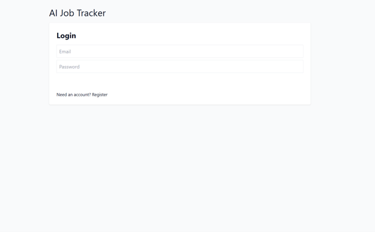

# 🧠 AI Job Tracker

### AI Job Tracker is a full-stack MERN application that helps users track their job applications, generate AI-based interview questions, and export reports in CSV or PDF format — all with secure JWT authentication.

### Built with:

⚛️ React (frontend)

🟢 Node.js + Express (backend)

🍃 MongoDB + Mongoose

🤖 OpenAI API (AI-powered features)

🚀 Features

✅ User Authentication
Register and login with secure password hashing (bcrypt + JWT).

✅ Job Tracking Dashboard
Add, edit, delete, and categorize job applications (Applied, Interview, Offer, Rejected).

✅ AI Interview Assistant
Automatically generate tailored interview questions using OpenAI based on job descriptions.

✅ Export Data
Download your job list as a CSV or PDF report.

✅ Real-Time Insights (Optional)
Easily extend the app to visualize application trends using Recharts.

2️⃣ Install backend dependencies
cd server
npm install

3️⃣ Create .env file in /server
MONGO_URI=your_mongodb_connection_string
OPENAI_KEY=your_openai_api_key
JWT_SECRET=your_secret_key
PORT=5000

4️⃣ Run the backend
npm run dev

Make sure your MongoDB instance is running (local or Atlas).

5️⃣ Install frontend dependencies
cd ../client
npm install

6️⃣ Run the frontend
npm start

The frontend runs at http://localhost:3000
The backend runs at http://localhost:5000

Add this to /client/package.json for local proxy:

"proxy": "http://localhost:5000"

📡 API Endpoints Overview
Method	Endpoint	Description	Auth
POST	/api/auth/register	Register new user
POST	/api/auth/login	Login user	
GET	/api/jobs	Get all user jobs	
POST	/api/jobs	Create new job	
PUT	/api/jobs/:id	Update job	
DELETE	/api/jobs/:id	Delete job	
POST	/api/jobs/questions	Generate interview questions	

✅ = Requires Authorization: Bearer <token>

🧑‍💻 Example Demo Flow

Register a new user

Login → get JWT saved in localStorage

Add a job application

Ask AI for interview questions

Logout safely

🛡️ Security Notes

Passwords are hashed using bcrypt.

Tokens are signed with JWT secret.

AI requests happen server-side — API key never exposed.

🏆 Author

Sahar

